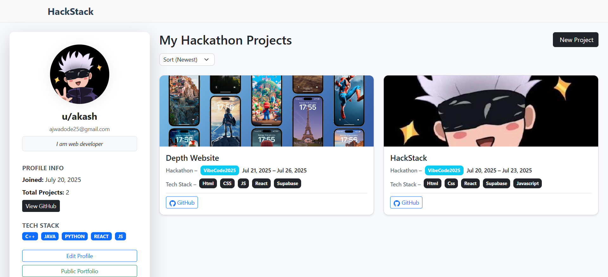
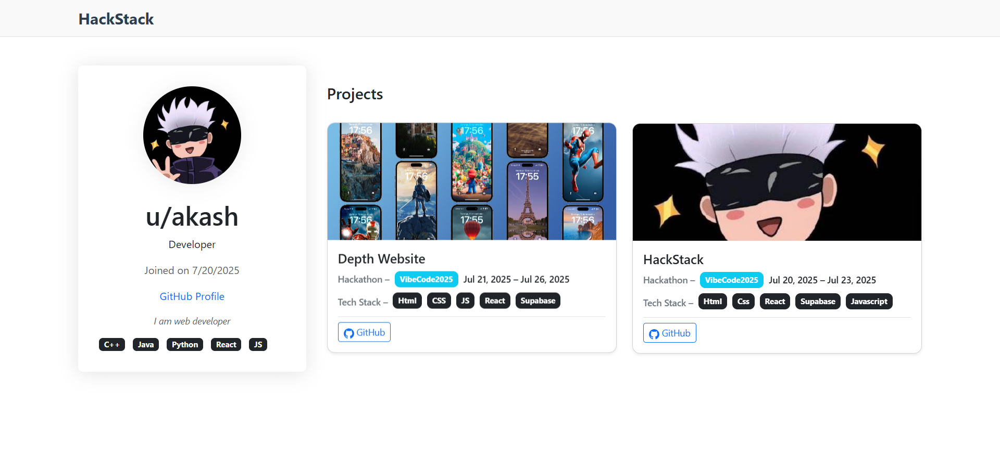

# HackStack 🎯

HackStack is a sleek and user-friendly web platform for developers—especially hackathon participants—to create, manage, and publicly showcase their project portfolios.

 <!-- Replace with your actual image path -->

## 🔗 Live Demo

Visit: [HackStack Live Site](https://your-netlify-site-url.netlify.app) <!-- Replace with your live site URL -->

---

## 👤 Author

**Akash Wadode**  
📧 ajwadode25@gmail.com  
🎓 MCA AI/ML, Lovely Professional University  
🔗 GitHub: [akashwadode/HackStack](https://github.com/akashwadode/HackStack)

---

## 🚀 Features

- 🔐 **User Authentication** — Signup/Login with Supabase Auth
- 🧑‍💼 **Dashboard** — Manage your profile and hackathon projects
- 🛠 **Project Management** — Add, edit, delete project entries with metadata
- 🌐 **Public Portfolio** — Shareable public link to showcase all your public projects
- 📱 **Responsive Design** — Mobile-friendly and modern layout
- 📦 **Tech Stack Badging** — Visual representation of your technologies
- 🎓 **Certificate Links** — Include certificates and GitHub/live demo URLs

---

## 🛠 Tech Stack

| Tech               | Role                         |
|--------------------|------------------------------|
| **React + Vite**   | Frontend development         |
| **React Router**   | Client-side routing          |
| **Supabase**       | Backend (Auth + Database)    |
| **Bootstrap**      | UI styling and layout        |
| **CSS Modules**    | Scoped and maintainable CSS  |

---

## 📁 Project Structure
📦 HackStack/
├── 📁 components/
├── 📁 pages/
├── 📁 styles/
├── 📁 assets/ (screenshots/logo)
├── 📄 supabaseClient.js
├── 📄 App.jsx
└── 📄 index.html


---

## 📸 Screenshots

| Dashboard | Public Portfolio |
|----------|------------------|
|  |  |


---

## 🧪 Getting Started Locally

```bash
git clone https://github.com/akashwadode/HackStack.git
cd HackStack
npm install
npm run dev
```
Make sure to configure your Supabase URL and anon key in supabaseClient.js.

🙌 Contributions
Pull requests are welcome. For major changes, open an issue first to discuss what you'd like to change.
